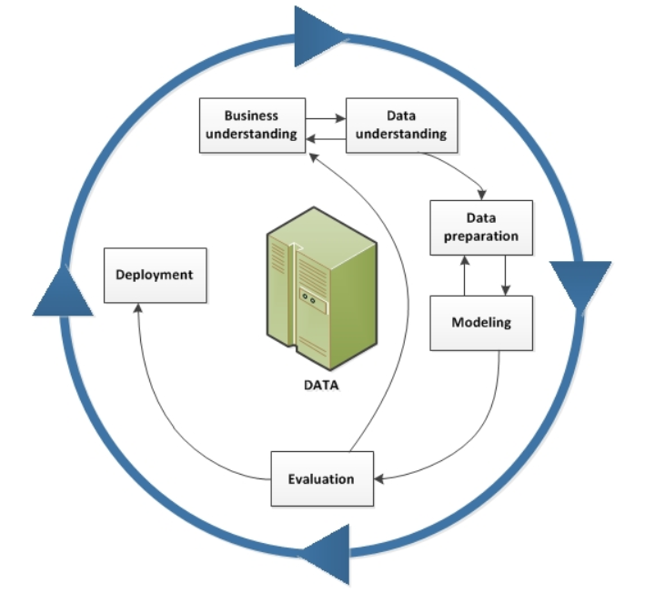
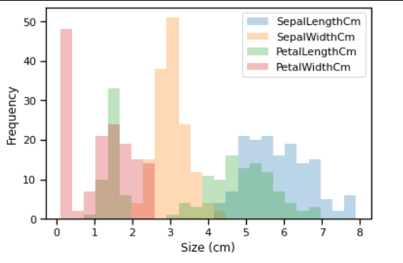
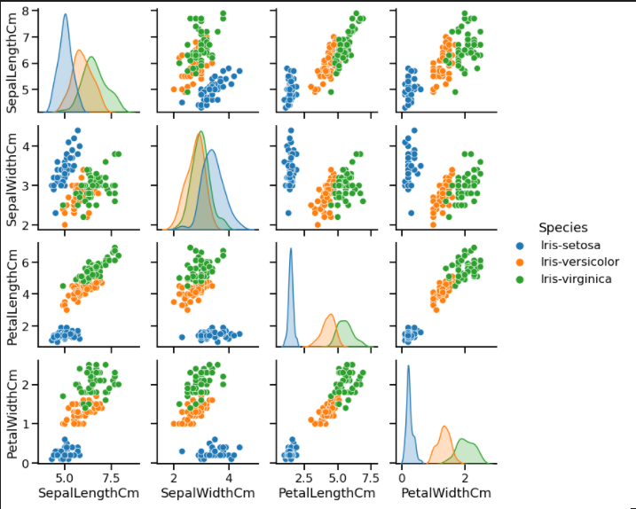
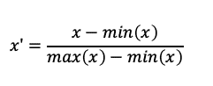
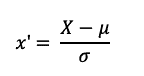
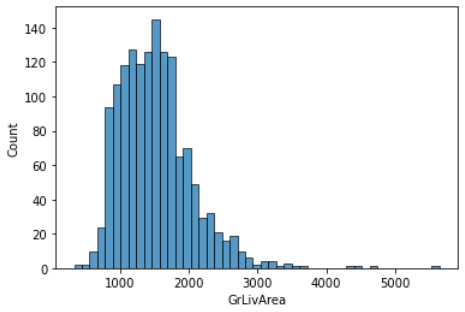
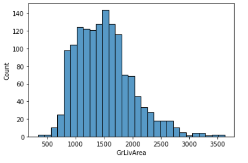
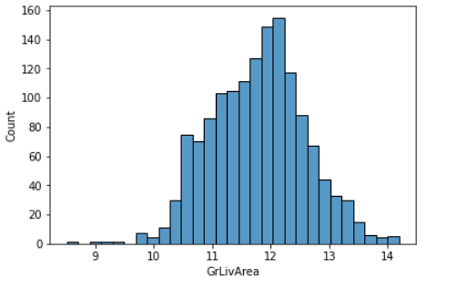

# 
Portafolio de Machine Learning de José Luis Vilaseca

## [LinkedIn](https://www.linkedin.com/in/jose-luis-vilaseca/) [GitHub](https://github.com/JoseVilaseca/josevilaseca.github.io)

## Índice
1. [Introducción](#Introducción)
2. [Crisp DM](#Crisp-DM)
3. [Entendimiento del Negocio](#Entendimiento-del-Negocio)
4. [Entendimiento de los Datos](#Entendimiento-de-los-Datos)
5. [Preparación de los Datos](#Preparación-de-los-Datos)
6. [Modelado](#Modelado)
7. [Caso de estudio 1](#Caso-de-estudio-1)
8. [Artículos publicados y presentaciones realizadas](#Artículos-publicados-y-presentaciones-realizadas)

## Introducción
El propósito de este portafolio es demostrar las habilidades adquiridas relacionadas con Inteligencia artificial.

El desarrollo de soluciones que utilicen inteligencia artificial debe ser holistico en el sentido que todas las partes/períodos del desarrollo son sumamente importantes y están muy interrelacionadas entre sí. Por esto, existe un estándar llamado CRISP DM, en el cual se basará este portafolio para explicar qué se debe hacer en cada paso del desarrollo de soluciones, con los puntos clave en cada uno de ellos. 

## Crisp DM
El proceso CRISP-DM (Cross-Industry Standard Process for Data Mining) describe las fases principales de un proyecto de minería/ciencia de datos, incluyendo la relación que existe entre cada etapa. 

  

A continuación se explicará qué se debe considerar en cada etapa del proceso CRISP-DM.

## Entendimiento del Negocio
El entendimiento del negocio y de la industria para la cual se realizará un proyecto que involucre aprendizaje automático es sumamente importante. Hay ciertas industrias que priorizan el entendimiento de los modelos antes que la performance per se que estos tengan. Por ejemplo, para industrias en las que el resultado de una predicción puede afectar positiva o negativamente la vida de una persona, es muy importante que se pueda explicar por qué se tomó esa decisión, por lo que algunos algoritmos complejos (cajas negras, ej. redes neuronales profundas) quedan descartados para el modelado. 

También, la naturaleza de la solución pondrá restricciones sobre las distintas alternativas de una solución. Por ejemplo, un sistema de clasificación de imágenes/detección de objetos en tiempo real, deberá poder generar varias predicciones por segundo, lo que limita tanto el lugar en donde estará desplegado el modelo (probáblemente en un sistema embebido o en el edge) y deberá tener una potencia computacional alta para poder cumplir con las restricciones. Las librerías también deberán estar específicamente optimizadas para poder correr en sistemas que no posean grandes cantidades de memoria y ser sumamente eficientes en las funcionalidades que proveen (TF Lite es un buen ejemplo de esto). 

Por otro lado, si estamos hablando de soluciones en las que el modelo se entrena una vez por día y se tiene un conjunto muy grande de datos, se deberán priorizar los algoritmos que puedan proveer una performance decente, pero principalmente que posean un tiempo de entrenamiento bajo, para cumplir con las restricciones temporales.

 

## Entendimiento de los Datos
Luego de entender el negocio y las posibles aristas por las que se podrá proseguir en un proyecto, el siguiente paso es entender los datos. El entendimiento de los datos o análisis exploratorio de los datos, es nuestro primer acercamiento a ellos. En él, se intentarán descubrir los patrones invisibles a primera vista que existen en los datos.

En  este paso, deberemos estudiar los tipos de los atributos, ver qué tipo de solución requiere el problema a resolver, ¿es de clasificación, regresión o clustering? También, se deben analizar las distribuciones de todos los atributos. Por último, se deben generar hipótesis sobre relaciones en los datos que luego deberán ser probadas en el paso del modelado.

  

  

## Preparación de los Datos
Nuestros modelos son tan buenos como los son nuestros datos. Por esto es muy importante hacer un preprocesamiento a los mismos acorde al algoritmo de aprendizaje que vayamos a utilizar para modelar el problema. Se deberá contar con una cantidad de datos suficiente y representativa para que los modelos generados puedan abstraer los conceptos subyacentes que existen en el conjunto de datos.

Debido a lo antes mencionado, hay varias aristas a recorrer en la etapa de la preparación de los datos.

### Normalizado y Estandarización
Existe una gran cantidad de algoritmos que obtienen mejores resultados cuando rangos de los predictores estén normalizados o estandarizados. Existen muchas formas de normalizar los datos pero a lo largo del portafolio, utilizaré las 2 más comunes mencionadas a continuación
#### Normalización Min-Max
Este tipo de normalización utiliza los valores mínimo y máximo del conjunto y utiliza la siguiente transformación para obtener los nuevos valores de nuestro predictor. Los posibles valores pertenecen al rango [0,1].

  

 #### Estandarización o Transformación Z
 Dicha técnica de normalizado refiere a la utilización de la media y de la desviación estándar de un atributo para realizar la siguiente transformación. La distribución resultante tendrá media 0 y desviación estandar 1.

  

### Manejo de valores faltantes o nulos
En un mundo ideal, los datasets no poseerían valores faltantes pero la realidad está bastante alejada de eso. Tanto en datasets utilizados mundialmente (por ejemplo Titanic) como también en datasets de empresas que quieren incorporar ciencia de datos a sus procesos, la presencia de valores nulos es algo común. 

En primera instancia, se debe analizar qué significan estos valores nulos, porque pueden tener distintos significados dependiendo del contexto. Uno de los posibles significados de un valor nulo es que no se cargó el dato o no se conoce el valor exacto, pero este dato probáblemente se encuentra en el rango de valores de la distribución del atributo al que pertenece (MAR).

Otro significado diferente es que un dato no tenga sentido que exista y debido a esto, se coloca el valor nulo en el ejemplo. Por ejemplo, en una encuesta en la que se pregunta por salario a personas, no tiene sentido que una persona que no posee un empleo actualmente cargue un valor numérico en el atributo salario.

Luego de conocer el significado de los valores nulos, hay que elegir una estrategia para tratarlos.

#### Elección de algoritmos que permitan valores nulos
Se pueden utilizar algoritmos como Naive Bayes o KNN.

#### Imputación de valores con media, mediana y moda
Para atributos numéricos, cuando la distribución de este es normal, se suele imputar con la media de la distribución. Cuando la distribución está sesgada, imputar con la mediana es una mejor elección.

Para atributos categóricos, imputar con la moda es una buena forma de deshacernos de los valores nulos.

#### Utilización de un modelo para predecir valores nulos.
Una estrategia más compleja, pero generalmente más aproximada es utilizar un modelo para predecir qué valor debería ocupar el lugar del valor nulo dependiendo de los otros atributos del ejemplo.

### Outliers
Los outliers son valores que se alejan significativamente del resto de la muestra. Dependiendo de nuestra aplicación en particular, estos casos deberán ser removidos o tratados con especial cuidado porque pueden llegar a ser claves para detectar algún fenómeno que estemos tratando de predecir (por ejemplo detección de fraude). 

  

### Muestreo para dasets desbalanceados
Cuando se posee un dataset significativamente desbalanceado, los ejemplos de una de las clases tienen una cardinalidad significativamente menor que la cardinalidad de los ejemplos de la otra clase (para problemas de clasificación binaria). La relación entre ellas puede ser 1:50, 1:100 o incluso más diferencia.

Este sesgo puede influir en el aprendizaje de muchos algoritmos de machine learning, lo que suele resultar en un sobreajuste que predice siempre la clase más numerosa, o tiene una performance baja para predecir ejemplos de la clase minoritaria, que suelen ser los casos más importantes y los que nos interesa reconocer.

Dos estrategias posibles para atacar estos casos es aplicar submuestreo (undersampling) o sobremuestreo (oversampling). En el submuestreo se reduce la cantidad de ejemplos de la clase más numerosa de forma aleatoria y en el sobremuestreo se generan nuevos ejemplos de la clase menos numerosa a partir de los ejemplos existentes. Una de las librerías más utilizadas que ataca este problema se llama imblearn.

### Transformaciones para atributos con distribución sesgada
Para distribuciones fuertemente sesgadas (skewed), aplicar transformaciones a la misma generalmente mejora la performance de los modelos entrenados con dichos datos. Dos transformaciones recomendadas son la función logarítmica y la transformación Box-Cox.

  

  

### Selección de atributos y feature engineering (To do)

## Modelado  
La etapa de modelado refiere a la creación de modelos a partir de datos. Estos modelos aprenderán de relaciones entre los datos con los que se entrenen y podrán hacer predicciones sobre datos no vistos.

A continuación se presentarán 2 grandes categorías de algoritmos de Machine Learning: los algoritmos lineales y los no lineales.
### Algoritmos Lineales
Los algoritmos lineales asumen una relación lineal entre los predictores y la variable objetivo. Son algoritmos simples que tienen un gran potencial para modelar relaciones lineales. El poseer distribuciones gausianas en los atributos ayuda a estos algoritmos a obtener mejores resultados.
#### Regresión Lineal
A pesar de la simplicidad del algortitmo de regresión lineal, este algoritmo sigue siendo muy utilizado por su capacidad de modelar relaciones lineales. A diferencia de algoritmos más complejos, este posee numerosas ventajas como lo son:

-Tiempo de entrenamiento bajo

-Posibilidad de explicar por qué se predice un valor para un ejemplo no visto

-Tiempo de predicción/inferencia bajo

#### Regresión Logística
Para problemas de clasificación binarios, la regresión logística es un algoritmo simple y performante. Este utiliza la función logística (o función sigmoide) que transforma una combinacion lineal de variables a un rango entre 0 y 1. En este caso, el valor que tomará la función coincide con la probabilidad con la que el modelo puede afirmar que un ejemplo pertenece a la clase por defecto. 

Utilizando esta probabilidad, podremos generar predicciones escogiendo un umbral (desde un aspecto probabilístico 0,5 sería el umbral correcto) y luego definiendo que un ejemplo pertenece a la clase primaria si su probabilidad es mayor a ese umbral y que pertenece a la clase secundaria en el caso contrario.

#### Análisis Discriminante Lineal
En el caso de problemas de clasificación multiclase, la opción lineal por defecto es el análisis discriminante lineal. Este algoritmo no posee ciertas desventajas que existen en la regresión logística como la limitación a problemas de 2 clases, su inestabilidad con clases bien separadas y su inestabilidad cuando se tienen pocos ejemplos.

### Algoritmos no lineales
Estos algoritmos no asumen una relación de algún tipo específico como lo hacen los algoritmos lineales. Suelen tener menos sesgo (bias) dado que no asumen una relación específica entre los predictores y la variable objetivo, pero una mayor varianza (variance) que los algoritmos lineales.
#### Árboles de Decisión
Los árboles de decisión son algoritmos que derivan de la rama de informática. Utilizando la estructura de un árbol, cada nodo posee una condición asociada a una única variable de entrada, y dependiendo del valor, el árbol decidirá por qué hijo se deberá proceder para que se pueda aplicar una predicción. Al llegar a un nodo hoja, se aplica la predicción.

Para el entrenamiento de los mismos se utilizan conceptos como la ganancia de información o el índice de gini para determinar cuáles son las mejores particiones de los datos tal que exista una mayor ganancia de información o mayor separación de las clases. 

Este tipo de algoritmo requiere que se aplique una optimización de hiperparámetros para reducir el sobreajuste del modelo al set de entrenamiento. Existen múltiples parámetros que ayudan a que el ajuste sea el correcto como por ejemplo limitar la altura del arbol, escoger un mínimo de ejemplos para cada nodo hoja, etc.

#### Máquinas de Soporte Vectorial
Las máquinas de soporte vectorial son un tipo de algoritmo de machine learning relativamente moderno (las primeras implementeciones se desarrollaron en los años 90). Este es un algoritmo para problemas de clasificación binaria (en su implementación básica, pues existen extensiones que amplian el algoritmo para problemas multiclase).

El propósito de este tipo de algoritmo es utilizar vectores de soporte (puntos de ambas clases que actúen como límites de su clase), un tipo de kernel (lineal, polinómico, radial, etc) y una constante C (definirá la flexibilidad con la que permitiremos violaciones respecto al márgen o frontera que se utilizará para la clasificación) para generar una función n-dimensional que separe a ambas clases de la mejor manera posible.

## Caso de estudio 1
En el caso de estudio 1 presente en la carpeta raiz del repositorio, se muestran los distintos pasos de un proyecto de datascience mencionados anteriormente y se intenta predecir precios de casas en Estados Unidos utilizando Regresión Lineal y Árboles de decisión para regresión.

## Artículos publicados y presentaciones realizadas

[Despliega tu primer modelo de reconocimiento de imágenes en la nube](https://developer.ibm.com/es/technologies/artificial-intelligence/patterns/despliega-tu-primer-modelo-de-reconocimiento-de-imgenes-personalizado-en-la-nube/)
[GitHub](https://github.com/IBM/ibm-developer-espanol/tree/master/contenido/inteligencia%20artificial/Reconocimiento%20de%20Im%C3%A1genes/codepattern_despliega-tu-primer-modelo-de-reconocimiento-de-imagenes)

[Watson de la A a la Z - Visual Recognition y Natural Language Classifier](https://www.youtube.com/watch?v=FnJ_eON3mBo&t=5705s&ab_channel=EnriqueTopolansky)

